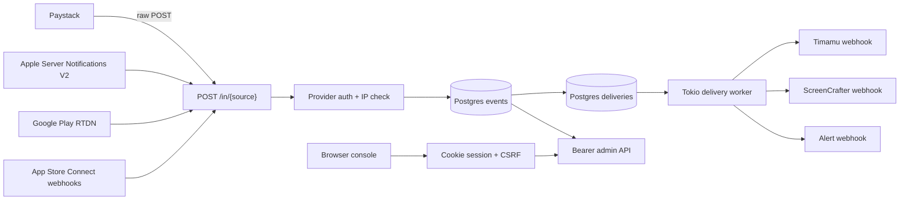
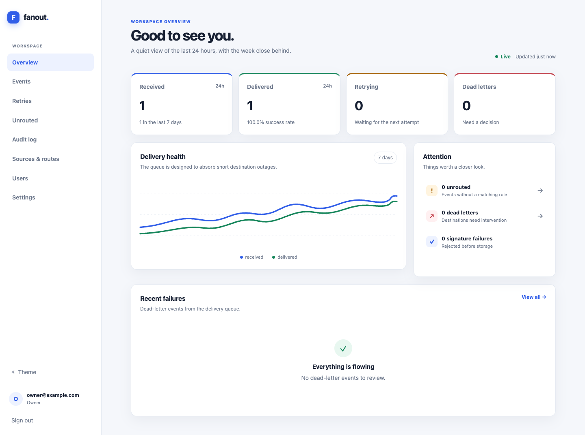
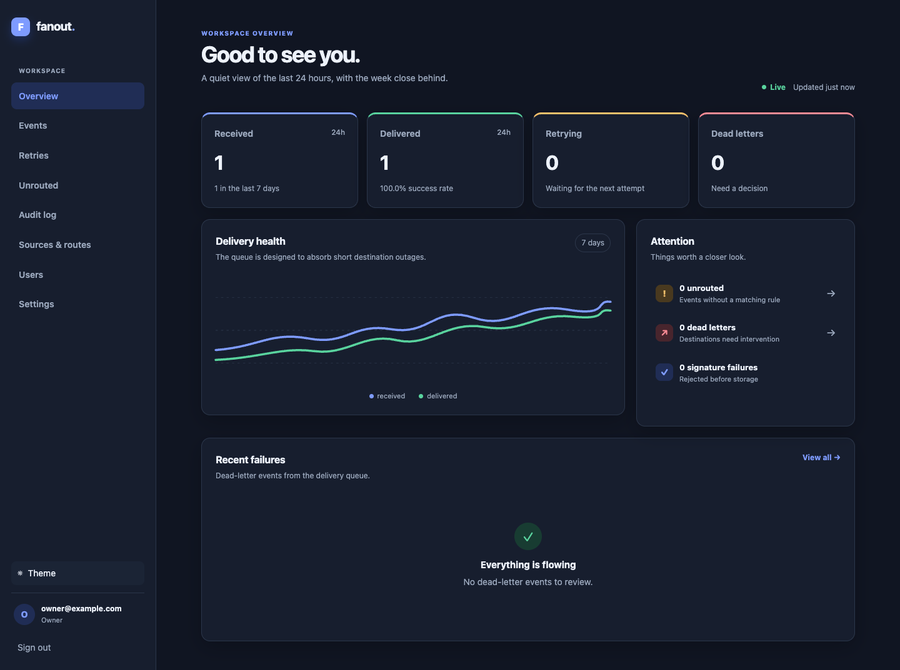

# paystack-fanout

Maintained by Vant Inc.

The service provides one durable webhook endpoint for a small set of products.
It verifies each source with its provider adapter, stores the original request,
and forwards the same bytes and authentication headers to the selected product
endpoint. It is intended for one business account, not as a hosted
multi-customer service.

## Architecture



The ingest path does only authentication, JSON field extraction, routing,
transactional persistence, and acknowledgement. Forwarding never runs inline.
The destination receives the original body and authentication headers,
unchanged, plus `X-Fanout-Event-Id` and `X-Fanout-Attempt`.

The implemented source providers are `paystack`,
`apple_server_notifications`, `apple_connect_webhooks`, and
`google_play_rtdn`.

## Quick start

```sh
cp .env.example .env
docker compose up -d postgres
git config core.hooksPath .githooks
cargo test
```

Set `DATABASE_URL`, `MASTER_ENCRYPTION_KEY`, and `ADMIN_BOOTSTRAP_TOKEN`, then run:

```sh
cargo run -- --role all
```

The listener binds to `0.0.0.0` and uses `PORT`, defaulting to `8080`. The
Paystack URL is `https://your-host/in/paystack_main`.

For the browser console, set a 32-byte `MASTER_ENCRYPTION_KEY`, then create the
first owner after migrations run:

```sh
export MASTER_ENCRYPTION_KEY="$(openssl rand -hex 32)"
cargo run -- create-owner --email owner@example.com
```

The command prompts twice and never installs default credentials. Open
`/login` to use the console. Set `COOKIE_SECURE=false` only for local HTTP
development; production keeps secure cookies enabled by default.

## Configuration

`FANOUT_CONFIG` is optional and is used only as a first-boot seed. If it is
unset or missing, the service starts with a Paystack source named
`paystack_main`, no routes, and the default 90-day retention. Routes and
sources are then managed in the dashboard and stored in Postgres. Secret
values are never read directly from the file; `secret_env` names the
environment variable that holds the value. Start local development from
[config.example.toml](config.example.toml).

```toml
[source.paystack_main]
provider = "paystack"
secret_env = "PAYSTACK_SECRET_KEY"
allowed_ips = ["52.31.139.75", "52.49.173.169", "52.214.14.220"]

[[route]]
name = "timamu"
destination_url = "https://example.invalid/timamu/paystack/webhook"
match = { metadata_app = "timamu", plan_code_prefix = "PLN_tm", reference_prefix = "tm_" }

[fallback]
mode = "unrouted"
```

`allowed_ips = []` disables the allowlist for that source. `TRUST_PROXY=true`
allows the first address in `X-Forwarded-For` to be checked; otherwise the TCP
peer address is used. The request body limit is 256 KiB. `RETENTION_DAYS`
defaults to 90; delivery records are kept for 30 days and delivered event
records follow the configured retention.

### Apple Server Notifications V2

Configure an App Store Server Notifications V2 source with provider
`apple_server_notifications`. It does not use a shared secret; the
`secret_env` field remains for configuration compatibility. The adapter
authenticates the outer `signedPayload` JWS, validates its `x5c` certificate
chain to the bundled Apple Root CA - G3 certificate, and then routes on the
signed payload's `data.bundleId` and `data.environment` values. The original
JSON body, including the inner signed transaction and renewal information, is
forwarded unchanged.

Use separate source names and routes for Production and Sandbox URLs in App
Store Connect, for example `/in/apple_production` and `/in/apple_sandbox`.
Set route `app_identifier` to the app's bundle ID and `environment` to
`production` or `sandbox`. The bundled certificate was downloaded from
[Apple PKI](https://www.apple.com/certificateauthority/); the signed payload
format and `x5c` chain are described in Apple's
[signedPayload](https://developer.apple.com/documentation/appstoreserverapi/signedpayload)
and [JWSDecodedHeader](https://developer.apple.com/documentation/appstoreserverapi/jwsdecodedheader).
The bundled certificate is stored at `src/certs/apple/AppleRootCA-G3.cer` for
container builds.

### App Store Connect webhooks

Configure an App Store Connect webhook source with provider
`apple_connect_webhooks`. App Store Connect sends the original JSON body and an
`x-apple-signature` header in the form `hmacsha256=<hex>`. The adapter verifies
the body with the secret configured for the webhook, then forwards the body and
signature unchanged. Event type comes from the webhook event `type` and the
event ID comes from its `id`; the app ID is taken from the documented app
fields when present and is used for route matching.

In App Store Connect, open Users and Access → Integrations → Webhooks, create a
webhook, enter the payload URL `/in/{source}`, choose the app, set a secret,
and select the event triggers. The current event families include build upload
state, app version state, beta feedback crash, and beta feedback screenshot
events. Use a route with `app_identifier` for an app-specific destination, or
set the fallback to `route:<name>` for a whole-account destination. Keep these
routes separate from payment routes.

Apple's current setup and signing details are documented in [Manage webhooks](https://developer.apple.com/help/app-store-connect/manage-your-team/manage-webhooks), [Configuring and parsing webhook notifications](https://developer.apple.com/documentation/appstoreconnectapi/configuring-webhook-notifications), and [WebhookEventType](https://developer.apple.com/documentation/appstoreconnectapi/webhookeventtype).

### Google Play Real-time developer notifications

Configure a Google Play Real-time developer notifications source with provider
`google_play_rtdn`. Google Play publishes an RTDN message to a Google Cloud
Pub/Sub topic. Create a wrapped push subscription for the source URL
`https://your-host/in/google_main`, enable authenticated push delivery, and
set the configured audience to that exact URL. Set `service_account` to the
email address of the service account that Pub/Sub uses to sign push requests.

Grant the Google Play service account permission to publish to the topic, then
configure the topic in Play Console under Monetize with Google Play →
Monetization setup → Real-time developer notifications. The adapter validates
the Pub/Sub Bearer JWT, refreshes Google's published signing certificates, and
requires the configured audience, service-account email, issuer, and verified
email claim.

RTDN messages are wrapped Pub/Sub envelopes. The adapter decodes
`message.data`, routes on the notification's `packageName`, and uses the
Pub/Sub `messageId` as the durable deduplication key. RTDN reports a state
change rather than the complete purchase state, so the product should query
the Google Play Developer API after receiving a notification. See Google's
[RTDN reference](https://developer.android.com/google/play/billing/rtdn-reference),
[Pub/Sub push delivery](https://cloud.google.com/pubsub/docs/push), and
[authenticated push subscriptions](https://cloud.google.com/pubsub/docs/authenticate-push-subscriptions)
for the provider-side setup and payload contract.

An alert destination may be enabled with:

```toml
[alerts]
webhook_url_env = "ALERT_WEBHOOK_URL"
```

The service sends a generic JSON body such as `{"text":"..."}`. It never
puts the event body, customer email, or phone number in logs or alert text.

## Routing rules

The first matching route wins, using this precedence:

1. `data.metadata.app`, or a `data.metadata.custom_fields` item whose
   `variable_name` is `app` and whose `value` is the application name.
2. `data.plan.plan_code`, `data.subscription.plan.plan_code`, or `data.plan`
   when `data.plan` is a string. The configured value is a prefix.
3. `data.reference`, then `data.subscription_code`, then
   `data.customer_code` when a reference is absent. The configured value is a
   prefix.
4. `app_identifier` matches a store bundle ID or package name.
5. `environment` matches `production` or `sandbox`.

Within a route, a configured matcher is a candidate for that precedence level;
the other legacy matchers do not have to be present. `app_identifier` and
`environment`, when both are configured, must both match. This lets a product
route store notifications to the correct application and environment.

If no route matches, `fallback.mode = "unrouted"` stores the event without a
delivery and sends an alert. `fallback.mode = "route:name"` sends it to that
route, which is useful during rollout.

## How to tag payments

Use one stable convention per product:

- Prefer `metadata.app = "timamu"` or `"screencrafter"`.
- For Checkout or API flows that already use references, use `tm_...` and
  `sc_...` prefixes.
- For subscription products, use plan code prefixes such as `PLN_tm...` and
  `PLN_sc...`.

The router does not modify a payload or create a new signature. Each product
continues to verify Paystack's signature itself.

## Paystack event fields

The field list below follows Paystack's public webhook and product examples.
Payloads are retained as raw bytes, so fields not listed here are preserved.

| Event family | Documented fields used or useful for routing |
| --- | --- |
| `charge.success` | `data.reference`, `data.metadata`, `data.plan` |
| `subscription.create` | `data.subscription_code`, `data.plan`, customer and metadata fields |
| `subscription.disable` | `data.subscription_code`, `data.plan`, `status` |
| `subscription.not_renew` | `data.subscription_code`, `data.plan`, `status` |
| `invoice.create` | `data.invoice_code`, subscription/plan information in the invoice payload |
| `invoice.update` | `data.invoice_code`, final invoice status, subscription/plan information |
| `invoice.payment_failed` | `data.invoice_code`, failed invoice status and subscription information |
| `transfer.success`, `transfer.failed`, `transfer.reversed` | `data.reference`, `data.transfer_code`, `data.status` |
| `refund.pending`, `refund.processing`, `refund.processed`, `refund.failed` | `data.transaction_reference`, `data.refund_reference`, `data.status` |

Paystack's refund examples use `transaction_reference`, not `reference`. The
requested routing contract intentionally checks only `reference`,
`subscription_code`, and `customer_code`, so refund events need
`metadata.app`, a configured fallback, or a future routing rule. The current
public examples also vary across event families; the router therefore does not
deserialize a rigid event struct.

References: [Paystack webhooks](https://paystack.com/docs/payments/webhooks/),
[subscriptions](https://paystack.com/docs/payments/subscriptions/),
[charge API](https://paystack.com/docs/api/charge/),
[transfers](https://paystack.com/docs/transfers/single-transfers/), and
[refunds](https://paystack.com/docs/payments/refunds/).

## Delivery behavior

The queue uses `FOR UPDATE SKIP LOCKED`, so multiple replicas claim separate
deliveries. A 2xx response marks an event delivered. Other responses and
network errors record an attempt and retry after 30s, 2m, 10m, 30m, 1h, 3h,
6h, 12h, and 24h, with 20% jitter. Attempt 10 is terminal and marks the
delivery dead. Response bodies are capped at 2 KiB in the attempt record.

The stored event has the raw body, signature, content type, a safe header
subset, event type, route, status, and receipt time. Invalid signatures return
401 and are never stored. Duplicate raw bodies for one source return 200 with
no new delivery.

## Admin and operations

When `ADMIN_TOKEN` or `ADMIN_BOOTSTRAP_TOKEN` is set, send `Authorization: Bearer ...` to:

- `GET /admin/events?status=&route=&type=&since=&limit=&offset=`
- `GET /admin/events/{id}`
- `POST /admin/events/{id}/replay` with optional `{"route":"timamu"}`
- `POST /admin/replay?status=dead&route=timamu`
- `GET /admin/routes`, `POST /admin/routes`, `PATCH /admin/routes/{name}`, and
  `DELETE /admin/routes/{name}`
- `GET /admin/deliveries?reference=...`
- `GET /admin/settings`, `PUT /admin/settings/{key}`, and
  `DELETE /admin/settings/{key}`

For example, add the Timamu route with both matching conventions:

```sh
curl -X POST "$APP_URL/admin/routes" \
  -H "Authorization: Bearer $ADMIN_TOKEN" \
  -H 'content-type: application/json' \
  -d '{"name":"timamu","target_url":"https://api.timamu.app/v1/billing/paystack/webhook","ref_prefix":"tm_","metadata_app":"timamu","enabled":true}'
```

When the token is unset, admin routes return 404. `/healthz` is liveness,
`/readyz` checks the database, and `/metrics` exposes Prometheus text metrics
including received, signature failures, duplicates, deliveries, retries,
dead events, unrouted events, shadow misses, and a delivery latency histogram.

Swagger UI is available at `/docs` (redirecting to `/docs/`), with the raw
OpenAPI document at `/api-docs/openapi.json`.

## Deploy on Railway

1. Create a Railway project with a Postgres service.
2. Deploy this repository as a Railway service. Railway builds directly from
   the repository `Dockerfile`.
3. Set these required variables in the service environment:
   - `DATABASE_URL`: reference the Railway Postgres service variable, for
     example `${{Postgres.DATABASE_URL}}`.
   - `MASTER_ENCRYPTION_KEY`: create one with `openssl rand -hex 32`.
   - `ADMIN_BOOTSTRAP_TOKEN`: a one-time token for creating the first admin.
4. In Railway service settings, set the health check path to `/readyz`.
5. Run `POST /admin/bootstrap` with the bootstrap bearer token and your email
   and password after the first deploy, then enable 2FA.
6. Use the service public URL as the Paystack webhook URL in test mode.
7. Add routes and sources from the dashboard; do not deploy a production route
   file.

## Rollout guide

1. Deploy and point the Paystack TEST mode webhook at
   `/in/paystack_main`; verify with test charges.
2. Set `fallback = "route:screencrafter"` while tagging rolls out. Watch the
`fanout_would_unrouted` metric and inspect route data.

## Browser console

The built-in console is server-rendered and ships inside the same binary. It
uses Askama templates, a vendored htmx asset, and a small local stylesheet; no
runtime asset host or separate frontend service is required.

Pages are available after signing in:

- `/admin` overview with 24-hour and seven-day queue health.
- `/dashboard/events` filtered event ledger and streamed CSV or newline JSON exports.
- `/dashboard/events/{id}` raw payload, masked headers, routing decision, and attempts.
- `/dashboard/retries` and `/dashboard/unrouted` operational queues.
- `/dashboard/config` persisted sources, routes, encrypted write-only secrets, and matcher tests.
- `/dashboard/users`, `/dashboard/audit`, and `/dashboard/settings` for access and policy.

| Role | Read | Replay/retry | Edit routes and export | Manage users | Manage sources/secrets |
| --- | --- | --- | --- | --- | --- |
| Viewer | Yes | No | No | No | No |
| Admin | Yes | Yes | Yes | Yes | No |
| Owner | Yes | Yes | Yes | Yes | Yes |

The JSON admin API remains available with `Authorization: Bearer $ADMIN_TOKEN`.
The dashboard is available at `/admin`; all application secrets can be stored
from the settings page or the settings API. Environment values override database
values, while database values are encrypted with `MASTER_ENCRYPTION_KEY`.
Browser sessions use an HttpOnly, SameSite=Lax cookie, rotate on sign-in, and
require a session-bound CSRF value on every mutating form. Passwords use
Argon2id. Login attempts are rate limited per account, and an optional TOTP
code is checked when a user has one configured.

### Screenshots

Light mode:



Dark mode:


3. Switch the live webhook URL. Keep the ScreenCrafter fallback until
   unrouted traffic is 0 for seven days, then set `fallback.mode = "unrouted"`.

## Load smoke

Run the local smoke against a running service with a small signed fixture:

```sh
seq 1 1000 | xargs -I{} -P8 curl -sS -o /dev/null -w '%{http_code}\n' \
  -X POST http://localhost:8080/in/paystack_main \
  -H 'content-type: application/json' \
  -H "x-paystack-signature: $SIGNATURE" \
  --data-binary @tests/fixtures/charge.success.json
```

Measure client-side latency with `hey` or `wrk` and keep the database on the
same machine. The target is p99 below 200ms; record the observed result in
your deployment notes because it depends on Postgres and disk speed.

Local smoke on 2026-09-28 with Postgres 16 in Docker, the debug binary, and
eight concurrent clients completed 1,000 unique signed events with p50 8.91ms,
p95 36.18ms, p99 109.41ms, and max 206.60ms.

## Tests

Unit coverage includes signatures, routing precedence, all listed fixture
event names, and the retry schedule. With `DATABASE_URL` set, the integration
suite exercises ingestion, duplicate suppression, forwarding, retry state,
replay, alert hooks, and concurrent queue claims. The CI workflow starts
Postgres, runs migrations, then runs formatting, linting, tests, and the Docker
build.

## Project boundaries

There is no billing, hosted multi-customer mode, or payload re-signing. The
Provider trait owns source authentication, event identity, event type, and
routing fields so additional provider payloads do not change the queue
contract.

Use conventional commit messages. License: MIT.
